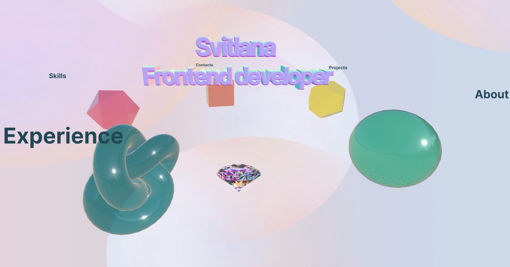

# Svitlana Tsupryk | Interactive 3D Portfolio

An interactive 3D portfolio built with React Three Fiber. Scroll to rotate the scene and click a figure to open a section.

**[Live demo →](https://svitlanatsupryk-jul18.github.io/my_portfolio/)**



## Features

- **Scroll-driven scene.** Five glass figures orbit a refractive diamond, and scrolling rotates the whole scene in an infinite loop.
- **Interactive sections.** Clicking a figure opens a card with About, Experience, Projects, Skills or Contacts.
- **Physically based materials.** Figures use transmission and clearcoat, glow in their own color when active and sparkle with particles.
- **Diamond with refraction and caustics** rendered from a dedicated environment map.
- **Parallax camera** that follows the pointer with damped easing.
- **Responsive layout** that rescales the scene on narrow screens.
- **SEO and social previews** with meta tags, Open Graph and structured data.

## Tech stack

| Area | Tools |
|---|---|
| UI | React 19 |
| 3D | three.js, React Three Fiber, Drei |
| Effects | @react-three/postprocessing (Bloom) |
| Animation | maath easing, CSS keyframes |
| Styles | SCSS |
| Tooling | Vite, ESLint, Leva (dev only) |
| Deploy | GitHub Pages via gh-pages |

## Technical decisions

- **GPU-friendly background.** The background texture was resized from 6000 px to 2048 px wide. This cut its GPU memory from about 145 MB to about 17 MB and keeps it within mobile texture limits.
- **Subset 3D font.** The typeface JSON for `Text3D` was reduced to basic Latin glyphs, from 803 KB to 23 KB.
- **Per-frame updates outside React.** The title fade-in runs in `useFrame` and changes material opacity through a ref instead of React state, so it does not re-render the scene every frame.
- **Memoized geometry.** Figure geometries are created once with `useMemo` and disposed on unmount to avoid GPU memory leaks.
- **BVH raycasting.** Drei `Bvh` speeds up pointer hit tests against the figures.
- **Leva only in development.** The tuning panel is useful while building but unnecessary for visitors. In production builds Vite aliases `leva` to a small stub that returns the default values, so no component code changes and the GUI library is excluded from the bundle.

## Getting started

```bash
npm install
npm run dev
```

Other scripts:

```bash
npm run build    # production build into dist/
npm run preview  # preview the production build locally
npm run lint     # run ESLint
npm run deploy   # build and publish to GitHub Pages
```

## Project structure

```
src/
  App.jsx               Canvas setup and dev-only Leva panel
  Experience.jsx        Background, environment lighting and scroll controls
  components/
    Scene.jsx           Rotating group, camera parallax, title and Bloom
    Section.jsx         Section labels, figure placement and section data
    Ball.jsx            Interactive figure with glow and sparkles
    Diamond.jsx         Refractive diamond with caustics
    ActiveCard.jsx      HTML card shown for the active section
    MainInfo.jsx        Card content for each section
    Loader.jsx          Loading spinner
  lib/
    leva-stub.js        Production replacement for Leva
public/                 Models, HDR maps, textures and fonts
```

## Contact

- LinkedIn: [svitlana-tsupryk](https://www.linkedin.com/in/svitlana-tsupryk-b65623a8/)
- Email: [stsupryk@gmail.com](mailto:stsupryk@gmail.com)
